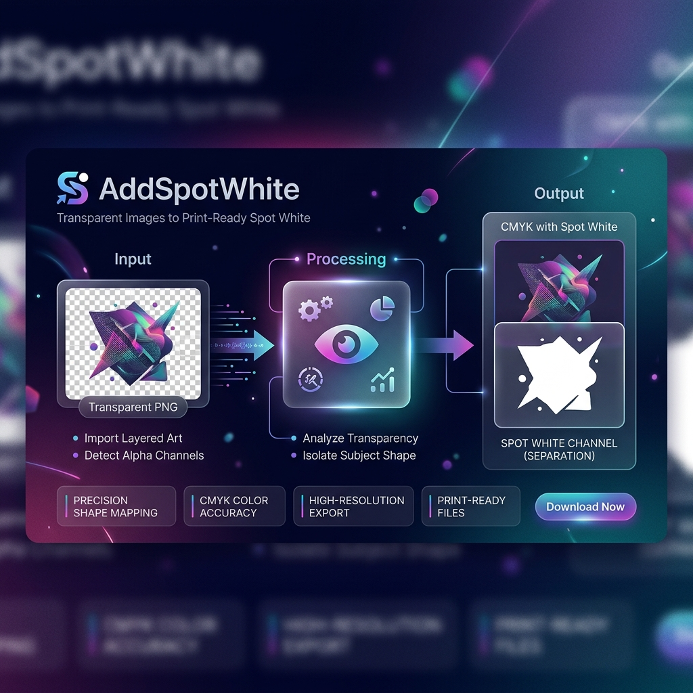

  
  
  <h1>🖌️ AddSpotWhite</h1>
  
<b>Скрипт для Adobe Illustrator для автоматической генерации каналов Spot White (выборочного белого) для печати.</b>

  
  

    <a href="#описание">Описание</a> •
    <a href="#особенности">Особенности</a> •
    <a href="#установка">Установка</a> •
    <a href="README_EN.md">English Version</a>
  

---

## 🎨 Описание
**AddSpotWhite** — это мощный скрипт для Adobe Photoshop (`SPOT_WHITE.jsx`), который автоматизирует процесс создания плашечного канала (Spot Color) белого цвета (`Spot_White`) для подготовки изображений к печати. 

Скрипт переводит документ в цветовую модель CMYK, выделяет видимые (непрозрачные) пиксели изображения и создает специальный канал, где черным цветом (100%) обозначается область, подлежащая покрытию белилами. После этого файл сохраняется в формате TIFF.

## ✨ Особенности
- 🔄 **Автоматическая конвертация**: Авто-перевод документа в CMYK, если необходимо.
- 🎯 **Точность**: Работает с прозрачностью слоя, создавая максимально точное выделение непрозрачных пикселей.
- ⚪ **Spot Channel**: Создание плашечного (Spot) канала `Spot_White`.
- 🔍 **Треппинг**: Автоматическое сжатие выделения на 1 пиксель (треппинг) для предотвращения вылезания белой подложки за края изображения при печати.
- 💾 **Сохранение**: Сохранение результата в TIFF (со сжатием LZW) с поддержкой плашечных каналов.

## 🛠 Установка
1. Скачайте файл `SPOT_WHITE.jsx` из этого репозитория.
2. Поместите его в папку скриптов Adobe Photoshop:
   - **Windows:** `C:\Program Files\Adobe\Adobe Photoshop [Версия]\Presets\Scripts\`
   - **macOS:** `/Applications/Adobe Photoshop [Версия]/Presets/Scripts/`
3. Перезапустите Photoshop. Скрипт появится в меню `Файл` -> `Сценарии` (`File` -> `Scripts`).
